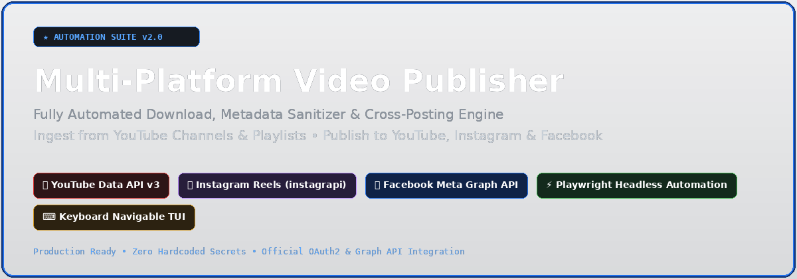
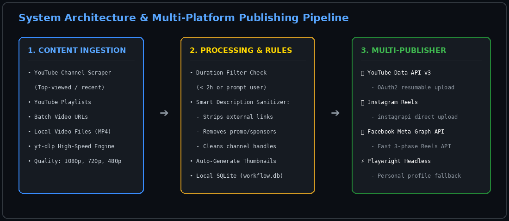
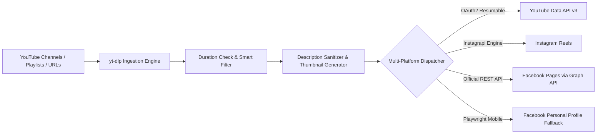
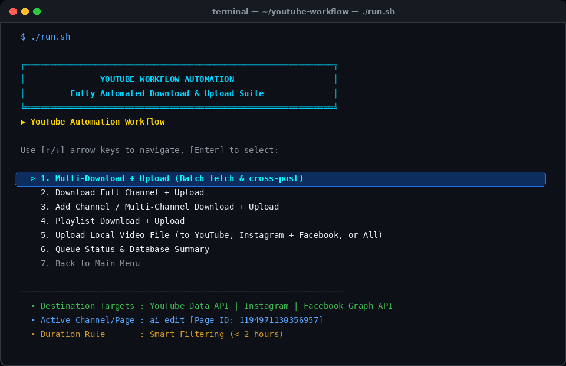
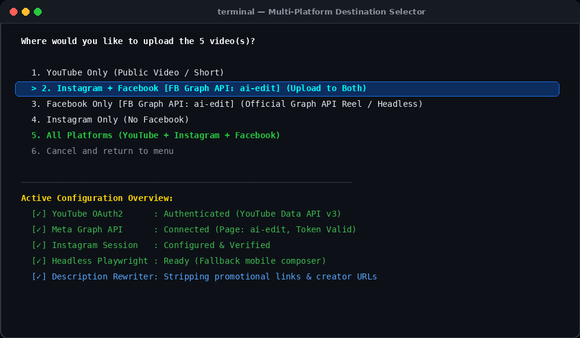

<div align="center">



# 🎬 Multi-Platform Video Publisher & Automation Suite

**Automated Content Ingestion, Metadata Sanitization & Cross-Platform Video Distribution**  
*Seamlessly publish video content to **YouTube**, **Instagram**, and **Facebook** directly from your terminal.*

[](https://python.org)
[](https://developers.facebook.com)
[](https://developers.google.com/youtube)
[](https://instagram.com)
[](https://playwright.dev)
[](LICENSE)

[Features](#-key-features) • [Architecture](#-architecture--pipeline) • [TUI Showcase](#-terminal-interface) • [Quick Start](#-quick-start) • [Configuration](#-configuration) • [CLI Usage](#-cli-commands)

</div>

---

## 🌟 Highlights

Managing video publishing across multiple social platforms often requires juggling web dashboards, manually converting video formats, re-uploading, and manually stripping original creator links or promotional text.

**Multi-Platform Video Publisher** automates the entire workflow from terminal:
- 📥 **Batch Fetching**: Ingest high-res videos, playlists, or entire channels using `yt-dlp`.
- 🧹 **Clean Description Rewriter**: Automatically strips third-party URLs, channel tags, and promotional links.
- 🚀 **One-Click Multi-Dispatch**: Send videos to **YouTube**, **Instagram Reels**, and **Facebook Pages / Profiles** simultaneously.
- ⚡ **Official Meta Graph API**: Instant, official 3-phase Reels upload for Facebook Pages (no UI breakage).
- 🤖 **Headless Browser Fallback**: Built-in Playwright mobile automation for direct posting to personal Facebook accounts.
- 🎯 **Interactive TUI**: Arrow-key navigation, real-time progress bars, and zero terminal clutter.

---

## 🏗 Architecture & Pipeline





---

## 🖥 Terminal Interface

### Main Automation Menu
Navigate effortlessly using your keyboard arrow keys `[↑/↓]` and select with `[Enter]`:

<div align="center">
  
</div>

### Multi-Platform Destination Selector
Choose whether to publish to a single platform or broadcast across all accounts at once:

<div align="center">
  
</div>

---

## 🚀 Key Features

### 🔴 1. YouTube Channel & Playlist Automation
* **Channel Scraping**: Automatically discovers the most-viewed videos from any YouTube channel handle or URL.
* **Smart Duration Filter**: Automatically checks video lengths before downloading (e.g. enforce `< 2 hours` rule or prompt on long content).
* **YouTube Data API v3**: Authenticates via Google OAuth2 with secure local token storage and automatic refresh.

### 🟣 2. Instagram Reels Integration
* **Native Reels Upload**: Direct mobile Reels publishing with custom aspect-ratio handling and auto-generated video thumbnails.
* **Safe Session Persistence**: Saves Instagram sessions and cookies locally for non-interactive automation.

### 🔵 3. Facebook Dual-Mode Publishing
* **Official Meta Graph API (Pages)**:
  * Uses Meta's 3-phase Reels protocol: `start` $\rightarrow$ `rupload` $\rightarrow$ `publish`.
  * Instant, sub-second API requests immune to web DOM changes or browser overhead.
  * Verified for Facebook Pages (e.g. `ai-edit`).
* **Headless Playwright Automation (Personal Profiles)**:
  * Uses lightweight Chromium mobile emulation (Pixel 7).
  * Direct browser posting using stored session cookies (`c_user`, `xs`) when Graph API is unavailable.
* **Instagram Cross-Posting**: Automatically mirrors Reels to Facebook via Meta Accounts Center.

### 🛡 4. Clean Metadata Rewriter
* Automatically sanitizes video descriptions before publishing:
  * ❌ Strips external hyperlinks and tracking parameters.
  * ❌ Removes original creator social handles and promotional sponsor copy.
  * ✅ Formats clean, search-friendly titles and hashtags tailored for Shorts and Reels.

---

## 📦 Quick Start

### 1. Prerequisites
* **Python 3.10+**
* **FFmpeg** installed (`sudo apt install ffmpeg` or `brew install ffmpeg`)

### 2. Installation
```bash
# Clone the repository
git clone https://github.com/ayankandar2-ux/youtube-workflow.git
cd youtube-workflow

# Install Python dependencies
pip install -r requirements.txt

# Install Playwright browser engine
playwright install chromium
```

### 3. Launch Application
```bash
# Using the quick launcher
./run.sh

# Or directly with Python
python3 app.py
```

---

## ⚙️ Configuration

Copy the sample environment file:
```bash
cp .env.example .env
```

### Facebook Graph API (Pages)
In `.env`:
```env
FB_PAGE_ID=your_page_id_here
FB_PAGE_TOKEN=your_page_access_token_here
```
*You can also configure Facebook tokens and cookies interactively in `app.py` under **Settings $\rightarrow$ Facebook Settings**.*

### YouTube OAuth Credentials
1. Create a project in [Google Cloud Console](https://console.cloud.google.com/).
2. Enable **YouTube Data API v3**.
3. Download the client secret JSON file and save it as `client_secret_*.json` in the project root or `~/.hermes/`.

---

## 💻 CLI Commands

In addition to the interactive TUI (`app.py`), all features can be invoked via command line:

```bash
# Check integration status for Facebook (Graph API + Cookies)
python3 facebook_uploader.py status

# Upload any video file directly to Facebook Page
python3 facebook_uploader.py upload "/path/to/video.mp4" "My Caption #reels"

# Force upload via official Graph API
python3 facebook_uploader.py upload-graph "/path/to/video.mp4" "Reel Caption"

# Download 5 top-viewed videos from a YouTube channel
./yw channel "https://youtube.com/@channel" --count 5

# Download a playlist and enqueue for upload
./yw playlist "https://youtube.com/playlist?list=..." --quality 720p
```

---

## 📁 Repository Structure

```text
├── assets/                 # High-resolution screenshots and diagram graphics
│   ├── hero_banner.png
│   ├── demo_tui_main.png
│   ├── demo_destination.png
│   └── workflow_architecture.png
├── app.py                  # Full keyboard-navigable interactive TUI
├── youtube_workflow.py     # Ingestion, downloading & YouTube/IG upload engine
├── facebook_uploader.py    # Facebook Meta Graph API + Playwright uploader
├── oauth_server.py         # Local OAuth server for Google authentication
├── tui_menu.py             # Arrow-key ANSI terminal menu engine
├── run.sh                  # One-click startup shell script
├── yw                      # CLI wrapper shortcut
├── requirements.txt        # Python dependency list
├── .env.example            # Credentials template
└── .gitignore              # Strict privacy rules (excludes tokens, DBs & cookies)
```

---

## 🔒 Privacy & Security

* **Zero Hardcoded Secrets**: No access tokens, client secrets, passwords, or cookies are ever committed to the repository.
* **Strict `.gitignore`**: All databases (`workflow.db`), media downloads (`downloads/`), generated thumbnails (`thumbnails/`), and session files are ignored.
* **Local Processing**: All metadata rewriting and video conversions happen locally on your own machine.

---

## 📄 License

Distributed under the **MIT License**. See `LICENSE` for more information.

---

<div align="center">
  <sub>Built with ❤️ for automated content creators and video publishers.</sub>
</div>
